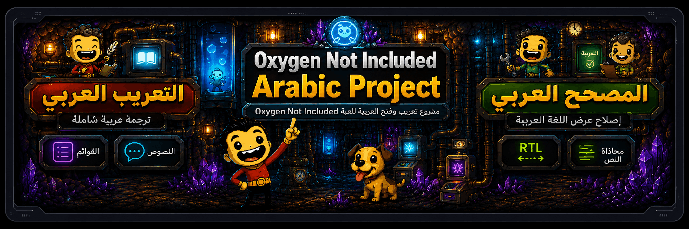
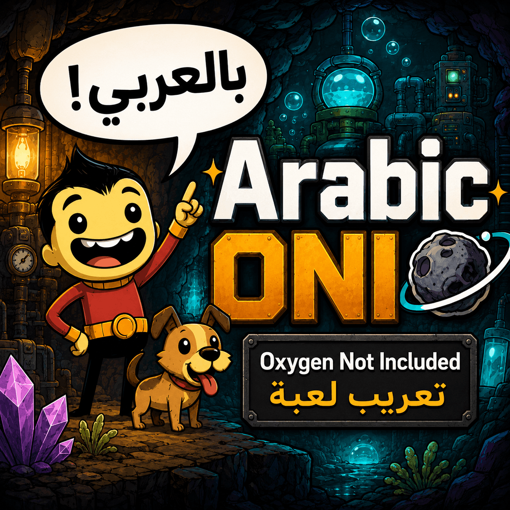
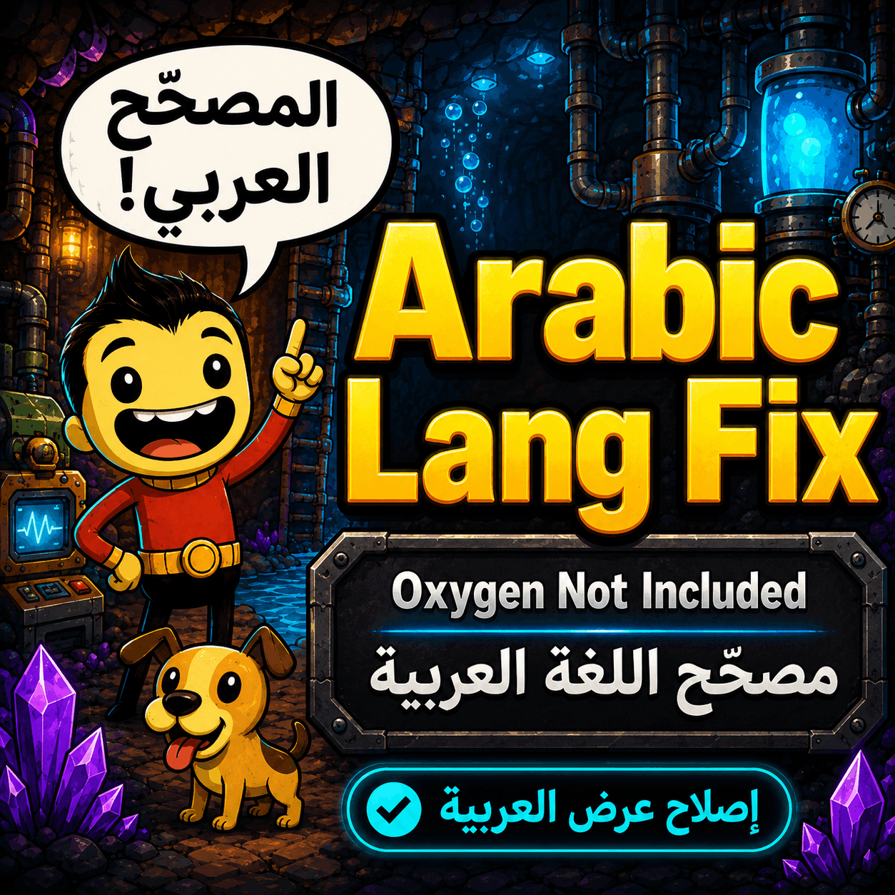

<div align="center" dir="rtl">



# مشروع تعريب لعبة Oxygen Not Included
### تعريب كامل ودعم العرض من اليمين إلى اليسار

<p align="center">
  <a href="https://store.steampowered.com/app/457140/Oxygen_Not_Included/">
    
  </a>
  
  
  
  <a href="#-الترخيص"></a>
</p>

**تعريب شامل للعبة Oxygen Not Included مع دعم حقيقي للكتابة من اليمين إلى اليسار وإصلاح عرض الحروف العربية.**

</div>

---

<div dir="rtl">

## ✨ نظرة عامة

لعبة **Oxygen Not Included** لا تدعم اللغة العربية بشكل رسمي، وحتى لو أضفت ملف ترجمة فإن محرك العرض **TextMeshPro** يرسم الحروف العربية **منفصلة ومعكوسة الاتجاه** مما يجعل النص غير مفهوم على الإطلاق.

هذا المستودع يحل المشكلتين معاً عن طريق **إضافتين متكاملتين** يجب تشغيلهما سوياً:

| الإضافة | المجلد | الوظيفة |
|---|---|---|
| 🅰️ **التعريب العربي** | [`Arabic/`](Arabic/) | يحتوي على ملفات الترجمة الفعلية (`strings.po` و `strings.mo`) — أكثر من **20,000** نص مترجم يشمل القوائم، المباني، السكان، الطعام، الأبحاث، والموسوعة. |
| 🛠️ **المصحح العربي** | [`ArabicFixer/`](ArabicFixer/) | إضافة برمجية (`ArabicTextFixMod.dll`) تستخدم **Harmony** لتعديل سلوك TextMeshPro، فتعيد تشكيل الحروف العربية وترتيبها من اليمين إلى اليسار بشكل صحيح داخل اللعبة. |

> 💡 **يجب تفعيل الإضافتين معاً.** الأولى تخبر اللعبة *ماذا* تكتب، والثانية تخبرها *كيف* ترسمها.

---

## 📸 معاينة الإضافتين

<div align="center">

| إضافة التعريب | إضافة الإصلاح |
|:---:|:---:|
|  |  |
| `Arabic/` | `ArabicFixer/` |

</div>

---

## 📦 محتويات المستودع

```
Oxygen-not-included-Arabic/
├── Arabic/                      ← إضافة الترجمة
│   ├── mod.yaml                 ← اسم الإضافة ووصفها والمؤلف
│   ├── mod_info.yaml            ← إصدار الـ API وأقل إصدار مدعوم من اللعبة
│   ├── strings.po               ← ملف الترجمة المصدر (حوالي 20,323 سطر)
│   ├── strings.mo               ← ملف الترجمة المُترجم (مضغوط)
│   └── preview.png              ← صورة معاينة الورشة
│
├── ArabicFixer/                 ← إضافة إصلاح العرض
│   ├── ArabicTextFixMod.dll     ← مكتبة Harmony لتعديل TextMeshPro
│   ├── mod.yaml
│   ├── mod_info.yaml
│   └── preview.png
│
└── Assets/
    └── header.png               ← صورة الرأس
```

---

## 🚀 طريقة التثبيت

هناك طريقتان حسب نسختك من اللعبة:

### 🅰️ الطريقة الأولى — عبر ورشة عمل ستيم (الأسهل)

إذا كنت تملك اللعبة على **Steam**، هذه أسهل وأسرع طريقة وستحصل على التحديثات تلقائياً:

1. شغّل **Oxygen Not Included** عبر ستيم.
2. من القائمة الرئيسية اختر **Mods → Browse** ثم ابحث في الورشة عن:
   - 🔗 **Arabic RTL** — إضافة الترجمة
   - 🔗 **Arabic Text Fix** — إضافة الإصلاح
   <sub>(ابحث بالاسم باللغة الإنجليزية، المؤلف **DiNaSoR**.)</sub>
3. اضغط **Subscribe** (اشتراك) على **كلتا** الإضافتين.
4. ارجع للعبة، افتح قائمة **Mods**، فعّل الإضافتين، ثم اضغط **Restart** عند طلب إعادة التشغيل.
5. اذهب إلى **Options → General → Language** واختر **Arabic**.

---

### 🅱️ الطريقة الثانية — التثبيت اليدوي (لغير مستخدمي ستيم: Epic / GOG / Game Pass)

استخدم هذه الطريقة إذا لم تكن نسختك من ستيم، أو إذا أردت التثبيت من هذا المستودع مباشرة.

#### 1. حمّل الملفات

- **بسهولة:** اضغط الزر الأخضر **`Code` → `Download ZIP`** في أعلى الصفحة، ثم فك ضغط الملف في مجلد مؤقت.
- **أو باستخدام Git:**
   ```bash
   git clone https://github.com/DiNaSoR/Oxygen-not-included-Arabic.git
   ```

#### 2. ابحث عن مجلد الإضافات المحلية

اللعبة تقرأ أي إضافة موجودة داخل مجلد **`Local`** ضمن مجلد الحفظ:

| نظام التشغيل | المسار |
|---|---|
| 🪟 **ويندوز** | `%USERPROFILE%\Documents\Klei\OxygenNotIncluded\mods\Local\` |
| 🍎 **ماك** | `~/Library/Application Support/Klei/OxygenNotIncluded/mods/Local/` |
| 🐧 **لينكس** | `~/.config/unity3d/Klei/Oxygen Not Included/mods/Local/` |

> إذا لم يكن مجلد `Local` موجوداً، أنشئه يدوياً.

#### 3. انسخ مجلدي الإضافة

من هذا المستودع، انسخ المجلدين التاليين **إلى داخل** مجلد `Local` أعلاه:

```
Arabic/         →   …/mods/Local/Arabic/
ArabicFixer/    →   …/mods/Local/ArabicFixer/
```

الشكل النهائي يجب أن يكون كالتالي — انتبه أن ملف `mod.yaml` يكون **مباشرة داخل** كل مجلد إضافة، وليس في مجلد فرعي:

```
…/Klei/OxygenNotIncluded/mods/Local/
├── Arabic/
│   ├── mod.yaml
│   ├── mod_info.yaml
│   ├── strings.po
│   └── strings.mo
└── ArabicFixer/
    ├── mod.yaml
    ├── mod_info.yaml
    └── ArabicTextFixMod.dll
```

#### 4. فعّل الإضافتين داخل اللعبة

1. شغّل اللعبة.
2. من القائمة الرئيسية اختر **Mods**. يفترض أن تظهر **Arabic RTL** و **Arabic Text Fix** ضمن قسم *Local*.
3. ضع علامة ✅ بجانب كل واحدة، ثم اضغط **Restart**.
4. اذهب إلى **Options → General → Language** واختر **Arabic**.

---

## ✅ التحقق من نجاح التثبيت

بعد إعادة تشغيل اللعبة، إذا كان كل شيء يعمل بشكل صحيح:

- أزرار القائمة الرئيسية تظهر بالعربية (مثل *لعبة جديدة*، *الإعدادات*).
- الحروف **متصلة** (`السلام` وليس `س ل ا م`) وتُقرأ من اليمين إلى اليسار.
- أسماء المباني، مهارات السكان، شروحات الموسوعة، والإشعارات كلها مترجمة.

| المشكلة | السبب الأرجح |
|---|---|
| الحروف منفصلة أو مقلوبة | إضافة **Arabic Text Fix** غير مفعلة. أعد الخطوة 4. |
| النصوص لا تزال إنجليزية | إضافة **Arabic RTL** غير مفعلة، أو لم تختر العربية من الإعدادات. |
| الإضافة لا تظهر في القائمة | المسار غير صحيح، راجع الخطوة 3. |

---

## 🛠️ حل المشكلات الشائعة

<details>
<summary><b>الإضافات لا تظهر في قائمة Mods</b></summary>

- تأكد أن المسار هو `…/mods/Local/Arabic/mod.yaml` وليس `…/mods/Local/Arabic/Arabic/mod.yaml` (تجنّب تكرار المجلد).
- أسماء المجلدات يجب أن تكون بالضبط: `Arabic` و `ArabicFixer`.
- اللعبة تحتاج إصدار **469473** أو أحدث. حدّث اللعبة إذا لزم الأمر.

</details>

<details>
<summary><b>اللعبة تتعطل عند بدء التشغيل بعد تفعيل الإضافات</b></summary>

- أوقف جميع الإضافات الأخرى وجرّب هاتين الإضافتين فقط.
- افتح ملف السجل `…\Klei\OxygenNotIncluded\Player.log` وأرسل الأسطر ذات الصلة في **Issue** جديد.

</details>

<details>
<summary><b>الحروف العربية منفصلة أو معكوسة</b></summary>

إضافة الإصلاح لا تعمل. الأسباب الشائعة:
- ويندوز حظر ملف الـ DLL. اضغط بزر الفأرة الأيمن على `ArabicTextFixMod.dll` ← **Properties** ← فعّل خيار **Unblock** ← Apply.
- الإضافة معطّلة في قائمة Mods.

</details>

<details>
<summary><b>بعض النصوص لا تزال بالإنجليزية</b></summary>

هذه النصوص لم تُترجم بعد. ساهم معنا في إكمال الترجمة (انظر القسم التالي).

</details>

---

## 🤝 المساهمة في التعريب

كل المساهمات مرحب بها وتُساعد آلاف اللاعبين العرب!

1. افتح ملف [`Arabic/strings.po`](Arabic/strings.po) باستخدام محرر مثل [Poedit](https://poedit.net/) (مجاني).
2. ابحث عن نص فارغ في حقل `msgstr ""` أو تحتاج تحسين ترجمته.
3. اكتب الترجمة، احفظ، وسيقوم Poedit تلقائياً بإعادة توليد ملف `strings.mo`.
4. أرسل **Pull Request** على GitHub.

بالنسبة لكود إضافة **Arabic Text Fix** المكتوبة بـ C#، الكود المصدري ليس متوفراً في المستودع حالياً. إذا كنت ترغب بالمساهمة برمجياً، افتح **Issue** أولاً للنقاش.

---

## 📚 ملاحظات تقنية

- **صيغة الترجمة:** ملفات `gettext` القياسية (`.po` للمصدر، `.mo` للنسخة المُجمّعة). اللعبة تقرأ الملف الثنائي `.mo` عند تشغيلها متى تطابق رمز اللغة في `mod.yaml` مع اختيار المستخدم.
- **إصلاح RTL:** ملف `ArabicTextFixMod.dll` يستخدم مكتبة **Harmony** لاعتراض دالة العرض في TextMeshPro، حيث يقوم بإعادة تشكيل الحروف العربية إلى أشكالها السياقية الصحيحة (مبدئية، وسطية، نهائية، منفردة)، ثم يطبّق خوارزمية **Unicode Bidi** لترتيب النصوص بصرياً من اليمين إلى اليسار.
- **الإصدارات:** كلتا الإضافتين تستخدمان `APIVersion: 2` وتدعمان `minimumSupportedBuild: 469473`.

---

## 👤 الفريق والاعتمادات

- **المطوّر:** [DiNaSoR](https://github.com/DiNaSoR)
- **اللعبة:** [Oxygen Not Included](https://store.steampowered.com/app/457140/Oxygen_Not_Included/) © [Klei Entertainment](https://klei.com/)
- **صورة الرأس:** `Assets/header.png` — تابعة لهذا المستودع.

هذا المشروع مجتمعي مجاني، **وليس له أي ارتباط رسمي أو دعم من شركة Klei Entertainment**.

---

## 📄 الترخيص

هذا المشروع مرخّص بموجب رخصة **MIT**. راجع ملف [`LICENSE`](LICENSE) لمزيد من التفاصيل.

</div>

---

<div align="center" dir="rtl">

### ⭐ إذا ساعدك المشروع، لا تنسَ وضع نجمة على المستودع وشاركه مع أصدقائك!

**صنع بـ ❤️ لمجتمع اللاعبين العرب**

</div>
